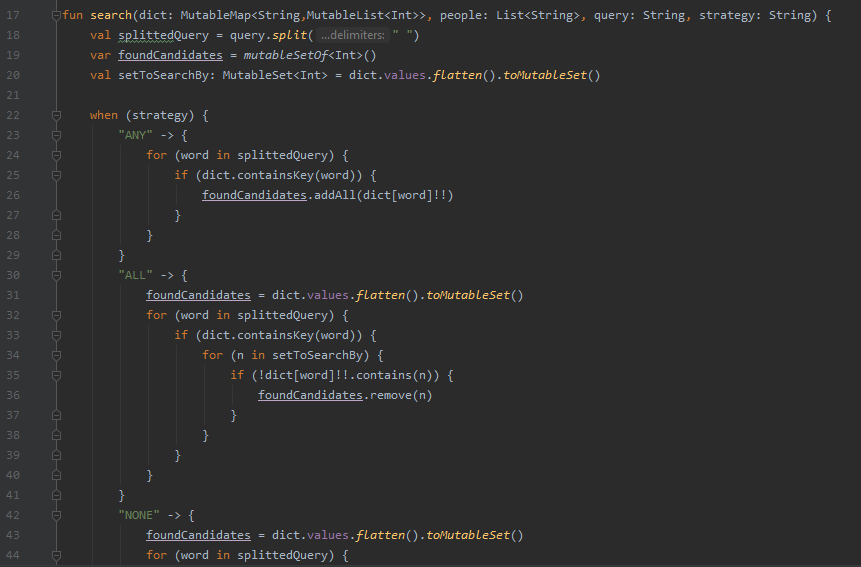

# JetBrains projects
> These are my JetBrains Academy projects from Kotlin Developer track, which I started in June 2020. All started and finished projects are put here.

## Table of contents
* [General info](#general-info)
* [Screenshots](#screenshots)
* [Technologies](#technologies)
* [Setup](#setup)
* [Features](#features)
* [Status](#status)
* [Inspiration](#inspiration)
* [Contact](#contact)

## General info
> Simple Search Engine (simpleSearchEngine.kt)

With over 13 hours I get to know a lot of features of Kotlin, developing search engine indexing imported text file, along with three options of searching.

## Screenshots

## Technologies
* Kotlin: version 1.3.72-release-468 (JRE 14.0.1+7)
* JDK: 14.0.1

## Setup
> Simple Search Engine (simpleSearchEngine.kt)

Main function of this piece of code takes source path to normal text file. It was succesfully compiled and run in IntelliJ IDEA 2019.3.4.

## Features
> Simple Search Engine (simpleSearchEngine.kt)

* Read data from text file
* Mapping single words to lines indexes where they are in text file
* Simple user menu
* Search options ALL (result must have all phrases from query), ANY (any word from query), NONE (cannot have words from query)
* Printing results of search
* Printing all available data

## Status
Project is: _finished_

## Inspiration
Willingness to get to know another programming language and to find more challenging job, more amount of free time and JetBrains discount until the end of year (should I also mention that last two are result of COVID?).

## Contact
maciej.konieczny.1993@gmail.com, feel free to contact me.