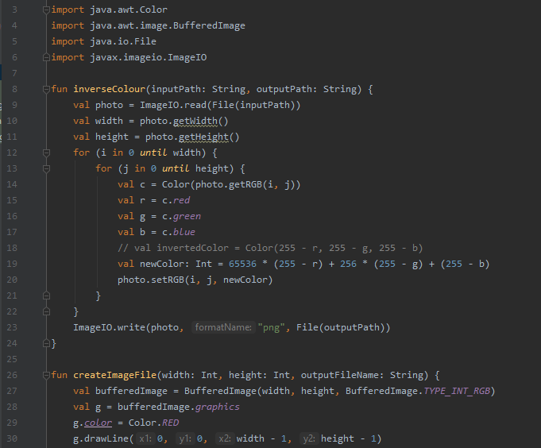

# JetBrains projects
> These are my JetBrains Academy projects from Kotlin Developer track, which I started in June 2020. All started and finished projects are put here.

## Table of contents
* [General info](#general-info)
* [Screenshots](#screenshots)
* [Technologies](#technologies)
* [Setup](#setup)
* [Features](#features)
* [Status](#status)
* [Inspiration](#inspiration)
* [Contact](#contact)

## General info
> [Simple Search Engine](https://hyperskill.org/projects/89?track=3) (simpleSearchEngine.kt) (difficulty level: Hard)

I've got to know a lot of features of Kotlin - developing search engine indexing over imported text file, with three options of searching.

> [Seam Carving](https://hyperskill.org/projects/100?track=3) (seamCarving.kt) (difficulty level: Challenging)

This project is focused on manipulating images with the use of Kotlin. Right now I have succesfully created simple image of declared size and inverted colors of imported photo with parameters of input and output declared by command line.

## Screenshots

## Technologies
* Kotlin: version 1.3.72-release-468 (JRE 14.0.1+7)
* JDK: 14.0.1
* Gradle

## Setup
> [Simple Search Engine](https://hyperskill.org/projects/89?track=3) (simpleSearchEngine.kt)

Main function of this piece of code takes as an argument String: source path to normal text file.

> [Seam Carving](https://hyperskill.org/projects/100?track=3) (seamCarving.kt)

Code can be run from command line with arguments -in <input file path> and -out <output file path>.

## Features
> [Simple Search Engine](https://hyperskill.org/projects/89?track=3) (simpleSearchEngine.kt)

* Read data from text file
* Mapping single words to lines indexes where they are in text file
* Simple user menu
* Search options ALL (result must have all phrases from query), ANY (any word from query), NONE (cannot have words from query)
* Printing results of search
* Printing all available data

> [Seam Carving](https://hyperskill.org/projects/100?track=3) (seamCarving.kt)

* Create a black image with two red crossed lines of given size and save it at given path
* Inverse colors of given photo file and save it at given path

## Status
> [Simple Search Engine](https://hyperskill.org/projects/89?track=3) (simpleSearchEngine.kt)
Project is: _finished_

> [Seam Carving](https://hyperskill.org/projects/100?track=3) (seamCarving.kt)
Project is: _in progress_

## Inspiration
Willingness to get to know another programming language and to find more challenging job, more amount of free time and JetBrains discount until the end of year (should I also mention that last two are result of COVID?).

## Contact
maciej.konieczny.1993@gmail.com, feel free to contact me.